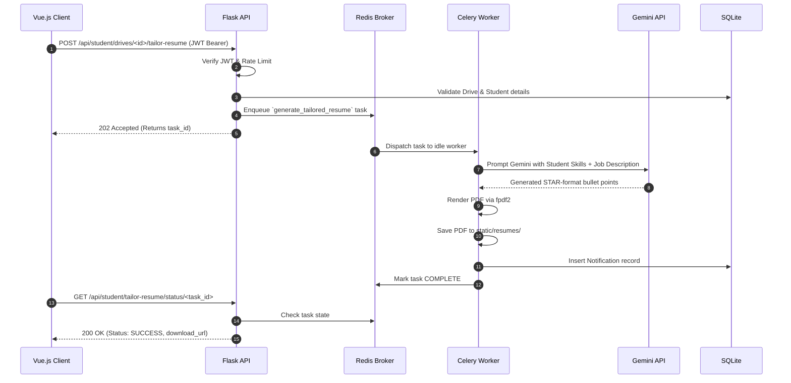

# HireSync AI (MAD2 Placement Portal)

**An AI-powered campus recruitment and placement platform that connects students with top companies.**

[](https://python.org)
[](https://flask.palletsprojects.com/)
[](https://vuejs.org/)
[](https://redis.io/)
[](https://docs.celeryq.dev/)

---

HireSync AI (formerly MAD2 Placement Portal) is a full-stack, production-ready campus recruitment platform built to handle the end-to-end placement lifecycle. It features AI-powered resume tailoring, asynchronous background job processing, robust caching, rate-limiting, and an optimized Vue.js SPA frontend.

---

## Table of Contents

- [Features](#features)
- [Tech Stack](#tech-stack)
- [System Architecture](#system-architecture)
- [Request Lifecycle](#request-lifecycle)
- [Authentication Flow](#authentication-flow)
- [Engineering Highlights & Trade-offs](#engineering-highlights--trade-offs)
- [API Routes](#api-routes)
- [Quick Start](#quick-start)
- [Configuration](#configuration)
- [Testing](#testing)

---

## Features

### For Students
| Capability | Details |
| --- | --- |
| **AI Resume Tailoring** | Gemini 2.0 AI generates tailored resume bullet points (STAR format) matching the `PlacementDrive` requirements, exported as a clean PDF via `fpdf2`. |
| **Drive Discovery** | Browse active placement drives, filter by company and roles, and one-click apply. |
| **Application Tracking** | Live pipeline tracking: Applied → Shortlisted → Interview Scheduled → Selected/Placed. |
| **Offer Letter Access** | Download official offer letters directly from the portal once placed. |

### For Companies
| Capability | Details |
| --- | --- |
| **Drive Management** | Create and manage placement drives with custom eligibility criteria and required skills. |
| **Applicant Pipeline** | Kanban-style applicant tracking. Filter by status, bulk update candidates. |
| **Interview Scheduling** | Schedule interviews directly; candidates receive real-time updates and notifications. |
| **Automated Reports** | Asynchronous Celery workers generate PDF/HTML monthly hiring reports and CSV data exports delivered via email. |

### For Admins
| Capability | Details |
| --- | --- |
| **Real-time Analytics** | Aggregated placement trends, application funnels, and top in-demand skills visualization. |
| **Approval Workflows** | Gatekeeping for new companies and drives to maintain platform quality. |
| **User Management** | Complete oversight over the student and company pools, including blacklisting capabilities. |

---

## Tech Stack

| Layer | Technology |
| --- | --- |
| **Backend Framework** | Python, Flask 3.1, Flask-RESTful |
| **Frontend Framework** | Vue.js 3 (SPA served via Flask catch-all route) |
| **Database** | SQLite via SQLAlchemy 2.0 (ORM) |
| **Background Jobs** | Celery 5.3 + Redis (Broker & Result Backend) |
| **Caching Layer** | Redis via Flask-Caching |
| **Security & Auth** | Flask-JWT-Extended (24h expiry), Flask-Limiter, bcrypt |
| **AI & ML Integration**| Google Gemini API (`google-genai`) |
| **PDF Generation** | `fpdf2` |
| **Testing** | `pytest`, `pytest-flask` |

---

## System Architecture

The platform follows a decoupled monolithic architecture. The frontend is a Vue.js SPA, communicating with a RESTful Flask API. Heavy tasks (AI generation, emails, PDF reports) are offloaded to Celery workers via Redis.

```mermaid
flowchart TD
    U([Users — Students, Companies, Admins])

    subgraph FE[" Presentation Layer — Vue.js SPA "]
        direction LR
        SPA[Vue Router & Components]
        CTX[State Management]
    end

    subgraph API[" API Layer — Flask (Gunicorn) "]
        direction LR
        RT[Route Handlers\nauth · admin · company · student]
        MW[Middleware Pipeline\nJWT Auth · Rate Limiting (Flask-Limiter)]
    end

    subgraph SVC[" Service Layer "]
        direction TB
        CACHE[Redis Cache\n5-10m TTL for Analytics & Drives]
        AI[Gemini AI\nResume Tailoring]
        PDF[Report & Resume\nPDF Generation]
    end
    
    subgraph WKR[" Background Workers — Celery "]
        direction TB
        BEAT[Celery Beat\nScheduled Tasks (e.g., Monthly Reports)]
        WORKER[Celery Workers\nEmail, CSV Export, AI Generation]
    end

    subgraph DATA[" Data Layer "]
        direction LR
        SQL[(SQLite\nPrimary Database)]
        REDIS[(Redis\nBroker & Cache)]
    end

    U --> SPA
    SPA -->|REST API| RT
    RT --> MW
    MW --> CACHE
    
    RT -->|Read/Write| SQL
    RT -->|Enqueue Task| REDIS
    
    REDIS -->|Consume Task| WORKER
    BEAT -->|Schedule Task| REDIS
    
    WORKER --> AI
    WORKER --> PDF
    WORKER -->|Write Results| SQL
```

---

## Request Lifecycle

Example: **AI Resume Tailoring Workflow**



---

## Authentication Flow

```mermaid
flowchart TD
    START([User Login]) --> POST[POST /api/auth/login]
    POST --> HASH[Verify bcrypt password hash]
    
    HASH -->|Valid| JWT[Issue JWT Access Token\n(24h expiry)]
    HASH -->|Invalid| ERR([401 Unauthorized])
    
    JWT --> CLIENT[Client stores JWT in memory/localStorage]
    CLIENT --> REQ[Attach to Authorization: Bearer Header]
    
    REQ --> MW{Flask-JWT-Extended}
    MW -->|Valid| ROUTE[Execute Route Logic]
    MW -->|Expired| REJ([401 Token Expired])
```

---

## Engineering Highlights & Trade-offs
*(Sourced from internal Issue Logs & Architectural Reviews)*

### 1. Graceful Degradation in Caching
**Challenge**: If the Redis cache fails, the API shouldn't return 500 Internal Server Error for read-heavy routes (like Public Stats or Admin Analytics).
**Solution**: Implemented `safe_get`, `safe_set`, and `safe_delete` wrapper functions in `cache_keys.py`. If Redis is unreachable, exceptions are caught and logged, and the application gracefully falls back to querying the primary SQLite database.

### 2. Preventing PII Data Leaks in Cached Endpoints
**Challenge**: Caching the `GET /api/student/drives` endpoint naively with a `@cache.cached` decorator would cache the first student's personal `applied_drive_ids` list and serve it to everyone else.
**Solution**: Manual cache layering. Only the shared, non-personal serialized drive list is cached in Redis. The endpoint fetches the shared list from cache, then independently queries the DB for the specific student's applied IDs, merging them at runtime.

### 3. Celery App Context & Singleton Pattern
**Challenge**: Celery workers crashed with `RuntimeError: Working outside of application context` when trying to execute SQLAlchemy database queries.
**Solution**: Created a custom `ContextTask` class inheriting from `celery.Task` that automatically pushes a `Flask` application context (`with app.app_context():`) before executing any task. Additionally, ensured `celery_worker.py` imports the singleton instance rather than calling `create_app()` twice to prevent empty task registries.

### 4. PDF Font Constraints (fpdf2)
**Challenge**: Background PDF report generation crashed on non-Latin-1 characters (like em-dashes `—`) because `fpdf2` core fonts do not support UTF-8 inherently.
**Solution**: Implemented a `_pdf_safe()` sanitation pipeline that intercepts all database strings (Job Titles, Company Names) and safely encodes them to Latin-1 using `errors='replace'` before PDF rendering, ensuring no hard crashes on unpredictable user input.

---

## API Routes

| Prefix | Blueprint | Key Responsibilities |
| --- | --- | --- |
| `/api/auth` | `auth.js` | JWT login, registration, `/me` profile fetch, logout. Rate limited (10/min). |
| `/api/admin` | `admin.js` | Platform analytics, company/drive approval workflows, caching invalidation. |
| `/api/company` | `company.js` | Drive CRUD, applicant kanban tracking, triggering Celery CSV exports. |
| `/api/student` | `student.js` | Drive discovery, applications, AI resume tailoring task triggers. |
| `/api/public` | `public.js` | Read-only pre-login aggregate statistics (Redis cached, 10 min TTL). |

---

## Quick Start

### Prerequisites
* Python 3.8+
* Redis Server (Running on localhost:6379)

### Setup & Run
```bash
# 1. Clone & Setup Virtual Environment
git clone https://github.com/yourusername/MAD2-Placement-Portal.git
cd MAD2-Placement-Portal
python -m venv venv
source venv/bin/activate  # On Windows: venv\Scripts\activate

# 2. Install Dependencies
pip install -r requirements.txt

# 3. Configure Environment
cp .env.example .env
# Ensure REDIS_URL and GEMINI_API_KEY are set in .env

# 4. Initialize Database with Seed Data
python init_db.py

# 5. Start the Services (In separate terminals)
# Terminal 1: Flask API
flask run --port=5000

# Terminal 2: Celery Worker
celery -A celery_worker.celery worker --loglevel=info

# Terminal 3: Celery Beat (Scheduled Jobs)
celery -A celery_worker.celery beat --loglevel=info
```

---

## Configuration (`.env`)

The system degrades gracefully. If `GEMINI_API_KEY` is missing, the AI Resume Tailorer falls back to standard profile formatting. If `MAIL_USERNAME` is missing, emails are logged to stdout instead of crashing.

```env
SECRET_KEY=super-secret-key
JWT_SECRET_KEY=jwt-secret-key
DATABASE_URL=sqlite:///instance/placement_portal.db
REDIS_URL=redis://localhost:6379
GEMINI_API_KEY=your_gemini_key_here  # Optional
MAIL_USERNAME=your_smtp_user         # Optional
MAIL_PASSWORD=your_smtp_pass         # Optional
```

---

## Testing

Comprehensive test suite using `pytest` and `pytest-flask`. Tests utilize an in-memory SQLite database and `SimpleCache`, completely bypassing Redis and external APIs for rapid, deterministic CI runs.

```bash
# Run the test suite
pytest -v tests/
```

---
*Built as a capstone placement portal project showcasing production-grade async processing, robust architecture, and AI integrations.*
