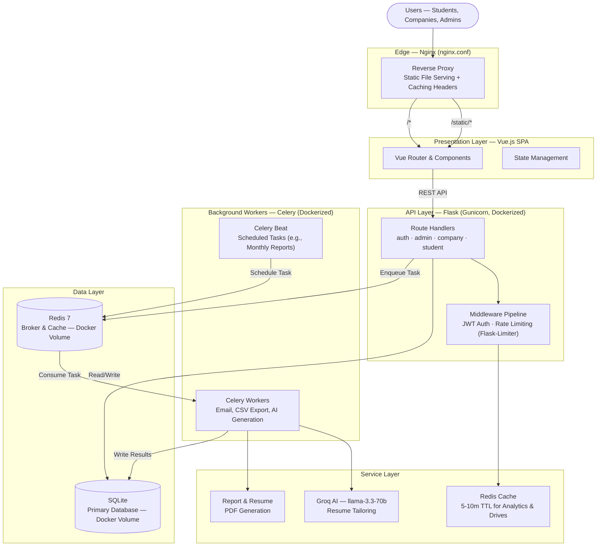
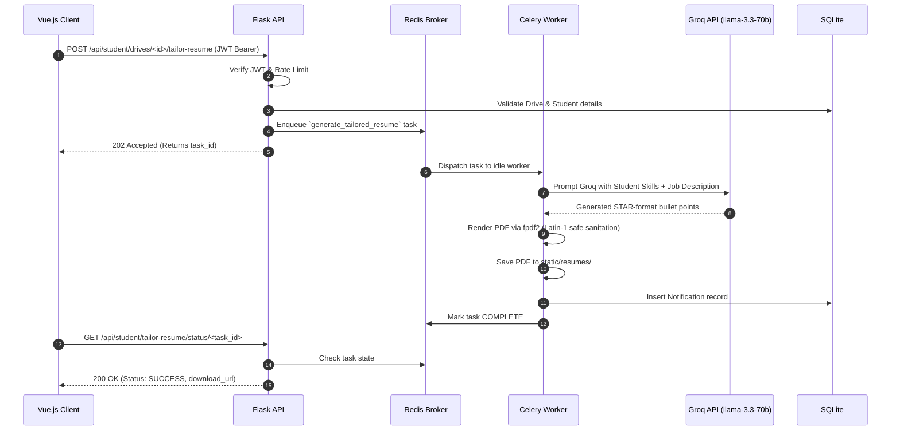
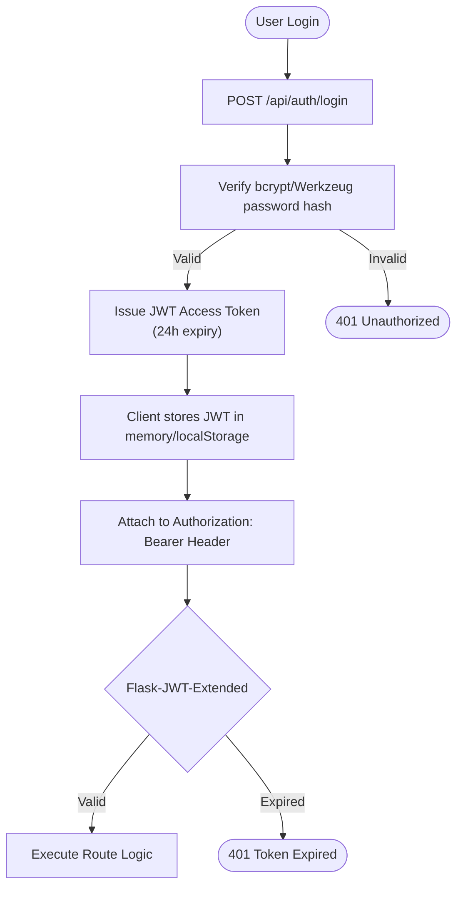
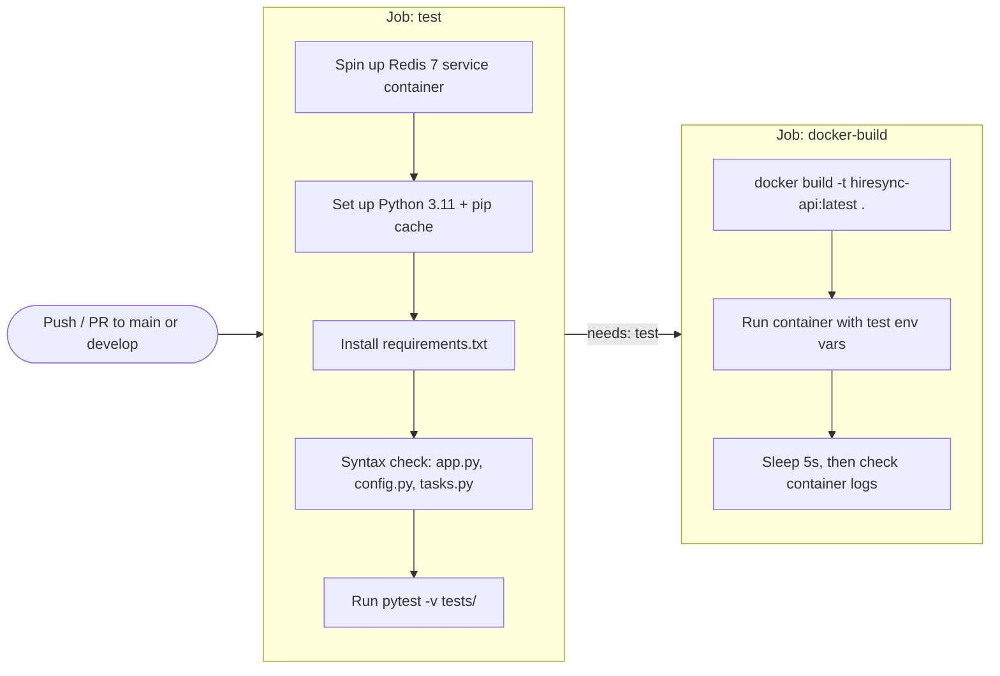

# HireSync AI (MAD2 Placement Portal)

**An AI-powered campus recruitment and placement platform that connects students with top companies.**

[](https://python.org)
[](https://flask.palletsprojects.com/)
[](https://vuejs.org/)
[](https://redis.io/)
[](https://docs.celeryq.dev/)
[](https://www.docker.com/)
[](https://github.com/archi829/pp-2/actions)

---

HireSync AI (formerly MAD2 Placement Portal) is a full-stack, production-ready campus recruitment platform built to handle the end-to-end placement lifecycle. It features AI-powered resume tailoring, asynchronous background job processing, robust caching, rate-limiting, and an optimized Vue.js SPA frontend — fully containerized with Docker and validated on every push via a GitHub Actions CI/CD pipeline.

---

## Table of Contents

- [Features](#features)
- [Tech Stack](#tech-stack)
- [System Architecture](#system-architecture)
- [Request Lifecycle](#request-lifecycle)
- [Authentication Flow](#authentication-flow)
- [Engineering Highlights & Trade-offs](#engineering-highlights--trade-offs)
- [API Routes](#api-routes)
- [Quick Start](#quick-start)
- [Running with Docker](#running-with-docker)
- [CI/CD Pipeline](#cicd-pipeline)
- [Configuration](#configuration)
- [Testing](#testing)
- [Project Documentation](#project-documentation)

---

## Features

### For Students
| Capability | Details |
| --- | --- |
| **AI Resume Tailoring** | Groq's `llama-3.3-70b-versatile` generates tailored resume bullet points (STAR format) matching the `PlacementDrive` requirements, exported as a clean PDF via `fpdf2`. |
| **Drive Discovery** | Browse active placement drives, filter by company and roles, and one-click apply. |
| **Application Tracking** | Live pipeline tracking: Applied → Shortlisted → Interview Scheduled → Selected/Placed. |
| **Offer Letter Access** | Download official offer letters directly from the portal once placed. |

### For Companies
| Capability | Details |
| --- | --- |
| **Drive Management** | Create and manage placement drives with custom eligibility criteria and required skills. |
| **Applicant Pipeline** | Kanban-style applicant tracking. Filter by status, bulk update candidates. |
| **Interview Scheduling** | Schedule interviews directly; candidates receive real-time updates and notifications. |
| **Automated Reports** | Asynchronous Celery workers generate PDF/HTML monthly hiring reports and CSV data exports delivered via email. |

### For Admins
| Capability | Details |
| --- | --- |
| **Real-time Analytics** | Aggregated placement trends, application funnels, and top in-demand skills visualization. |
| **Approval Workflows** | Gatekeeping for new companies and drives to maintain platform quality. |
| **User Management** | Complete oversight over the student and company pools, including blacklisting capabilities. |

---

## Tech Stack

| Layer | Technology |
| --- | --- |
| **Backend Framework** | Python 3.11, Flask 3.1, Flask-RESTful |
| **Frontend Framework** | Vue.js 2.7 + Vue Router 3 (CDN, no build step; SPA served via Flask catch-all route) |
| **Database** | SQLite via SQLAlchemy 2.0 (ORM) |
| **Background Jobs** | Celery 5.3 + Redis (Broker & Result Backend) |
| **Caching Layer** | Redis via Flask-Caching |
| **Security & Auth** | Flask-JWT-Extended (24h expiry), Flask-Limiter, Werkzeug password hashing |
| **AI & ML Integration**| Groq API (`groq` SDK) — `llama-3.3-70b-versatile` |
| **PDF Generation** | `fpdf2` |
| **Containerization** | Docker (multi-stage build), Docker Compose, non-root runtime user, Gunicorn |
| **CI/CD** | GitHub Actions — automated tests + Docker image build/smoke-test on every push |
| **Testing** | `pytest`, `pytest-flask` |

---

## System Architecture

The platform follows a decoupled monolithic architecture. The frontend is a Vue.js SPA, communicating with a RESTful Flask API. Heavy tasks (AI generation, emails, PDF reports) are offloaded to Celery workers via Redis. In production, the API and workers run as separate Docker containers behind an Nginx reverse proxy, orchestrated with Docker Compose.



---

## Request Lifecycle

Example: **AI Resume Tailoring Workflow**



---

## Authentication Flow



---

## Engineering Highlights & Trade-offs
*(Sourced from internal Issue Logs & Architectural Reviews)*

### 1. Graceful Degradation in Caching
**Challenge**: If the Redis cache fails, the API shouldn't return 500 Internal Server Error for read-heavy routes (like Public Stats or Admin Analytics).
**Solution**: Implemented `safe_get`, `safe_set`, and `safe_delete` wrapper functions in `cache_keys.py`. If Redis is unreachable, exceptions are caught and logged, and the application gracefully falls back to querying the primary SQLite database.

### 2. Preventing PII Data Leaks in Cached Endpoints
**Challenge**: Caching the `GET /api/student/drives` endpoint naively with a `@cache.cached` decorator would cache the first student's personal `applied_drive_ids` list and serve it to everyone else.
**Solution**: Manual cache layering. Only the shared, non-personal serialized drive list is cached in Redis. The endpoint fetches the shared list from cache, then independently queries the DB for the specific student's applied IDs (via `student_applied_ids_{student_id}`, 5 min TTL), merging them at runtime — with explicit invalidation whenever a student submits a new application.

### 3. Celery App Context & Singleton Pattern
**Challenge**: Celery workers crashed with `RuntimeError: Working outside of application context` when trying to execute SQLAlchemy database queries.
**Solution**: Created a custom `ContextTask` class inheriting from `celery.Task` that automatically pushes a `Flask` application context (`with app.app_context():`) before executing any task. Additionally, ensured `celery_worker.py` imports the singleton instance rather than calling `create_app()` twice to prevent empty task registries.

### 4. PDF Font Constraints (fpdf2)
**Challenge**: Background PDF report generation crashed on non-Latin-1 characters (like em-dashes `—`) because `fpdf2` core fonts do not support UTF-8 inherently.
**Solution**: Implemented a `_pdf_safe()` sanitation pipeline that intercepts all database strings (Job Titles, Company Names) and safely encodes them to Latin-1 using `errors='replace'` before PDF rendering, ensuring no hard crashes on unpredictable user input.

### 5. Reproducible, Secure Container Builds
**Challenge**: A naive single-stage Docker image bakes build tooling and pip's cache into the final image, bloating it and running the app as `root` — a security liability in production.
**Solution**: The `Dockerfile` uses a two-stage build: a `builder` stage creates a virtualenv and installs dependencies, then only the resulting `/opt/venv` and application code are copied into a clean runtime stage. A dedicated non-root `appuser` owns and runs the app, and Gunicorn (not the Flask dev server) serves it with 3 workers and a 120s timeout to accommodate longer AI/PDF requests.

---

## API Routes

| Prefix | Blueprint | Key Responsibilities |
| --- | --- | --- |
| `/api/auth` | `auth.js` | JWT login, registration, `/me` profile fetch, logout. Rate limited (10/min). |
| `/api/admin` | `admin.js` | Platform analytics, company/drive approval workflows, caching invalidation. |
| `/api/company` | `company.js` | Drive CRUD, applicant kanban tracking, triggering Celery CSV exports. |
| `/api/student` | `student.js` | Drive discovery, applications, AI resume tailoring task triggers. |
| `/api/public` | `public.js` | Read-only pre-login aggregate statistics (Redis cached, 10 min TTL). |

---

## Quick Start

The fastest way to get everything running (API, workers, and Redis) is [Docker Compose](#running-with-docker). To run services natively instead:

### Prerequisites
* Python 3.11+
* Redis Server (Running on localhost:6379)

### Setup & Run
```bash
# 1. Clone & Setup Virtual Environment
git clone https://github.com/archi829/pp-2.git
cd pp-2
python -m venv venv
source venv/bin/activate  # On Windows: venv\Scripts\activate

# 2. Install Dependencies
pip install -r requirements.txt

# 3. Configure Environment
cp .env.example .env
# Ensure REDIS_URL and GROQ_API_KEY are set in .env

# 4. Initialize Database with Seed Data
python init_db.py

# 5. Start the Services (In separate terminals)
# Terminal 1: Flask API
python app.py

# Terminal 2: Celery Worker
celery -A celery_worker.celery worker --loglevel=info

# Terminal 3: Celery Beat (Scheduled Jobs)
celery -A celery_worker.celery beat --loglevel=info
```

---

## Running with Docker

The project ships with a multi-stage `Dockerfile` and a `docker-compose.yml` that wires up the full stack — API, Celery worker, Celery beat, and Redis — with a single command.

```bash
# Build and start everything (API on :5000, Redis on :6379)
docker compose up --build

# Run in the background
docker compose up -d --build

# Tail logs for a specific service
docker compose logs -f web
docker compose logs -f worker

# Stop and remove containers
docker compose down
```

**Services defined in `docker-compose.yml`:**

| Service | Purpose | Notes |
| --- | --- | --- |
| `web` | Flask API served by Gunicorn | Persists `instance/`, `static/uploads/`, `static/resumes/` as bind-mounted volumes |
| `worker` | Celery worker | Handles email, CSV export, and AI resume generation tasks |
| `beat` | Celery beat scheduler | Fires the daily interview reminders and monthly report jobs |
| `redis` | Redis 7 (alpine) | Shared broker/cache backend, backed by a named `redis_data` volume |

Environment variables (`JWT_SECRET_KEY`, `SECRET_KEY`, `GROQ_API_KEY`) are read from your shell/`.env` at build time and passed through to each container.

An `nginx.conf` is also included in the repo for production deployments that want Nginx serving `/static/` directly and reverse-proxying everything else to the `web` container — drop it in as an additional service in front of `web` when deploying beyond local Compose.

---

## CI/CD Pipeline

Every push and pull request to `main` or `develop` runs the **HireSync CI/CD** workflow (`.github/workflows/ci.yml`) on GitHub Actions:



* **`test`** — starts a `redis:7-alpine` service container, installs dependencies, byte-compiles the core modules as a fast syntax gate, then runs the full `pytest` suite (which uses an in-memory SQLite DB and `SimpleCache`, so it never touches the real Redis service for caching).
* **`docker-build`** — runs only after `test` passes (`needs: test`). It builds the production image from the repo's `Dockerfile` and does a smoke test: start the container, wait a few seconds, and confirm it comes up cleanly via `docker logs`.

This means every change is validated both at the code level (tests) and at the deployment level (does the image actually build and boot) before it can be considered green.

---

## Configuration (`.env`)

The system degrades gracefully. If `GROQ_API_KEY` is missing, the AI Resume Tailorer falls back to a structured, non-AI resume built from the student's existing profile data. If `MAIL_USERNAME` is missing, emails are logged to stdout instead of crashing.

```env
SECRET_KEY=super-secret-key
JWT_SECRET_KEY=jwt-secret-key
DATABASE_URL=sqlite:///instance/placement_portal.db
REDIS_URL=redis://localhost:6379
GROQ_API_KEY=your_groq_key_here      # Optional — enables AI resume tailoring
GROQ_MODEL=llama-3.3-70b-versatile   # Optional override
MAIL_USERNAME=your_smtp_user         # Optional
MAIL_PASSWORD=your_smtp_pass         # Optional
```

---

## Testing

Comprehensive test suite using `pytest` and `pytest-flask`. Tests utilize an in-memory SQLite database and `SimpleCache`, completely bypassing Redis and external APIs for rapid, deterministic runs — the same suite that gates every CI run.

```bash
# Run the test suite
pytest -v tests/
```

---

## Project Documentation

The [`docs/`](./docs) folder contains detailed, milestone-by-milestone write-ups produced during development, including architectural decisions, issue logs, and verification/demo notes — useful for anyone digging into the history behind a specific feature (e.g. `MILESTONE_7_CELERY_JOBS.md`, `MILESTONE_8_REDIS_CACHING.md`, `ISSUES_LOG_M7_M8.md`).

---
*Built as a capstone placement portal project showcasing production-grade async processing, robust containerized architecture, CI/CD automation, and AI integrations.*
